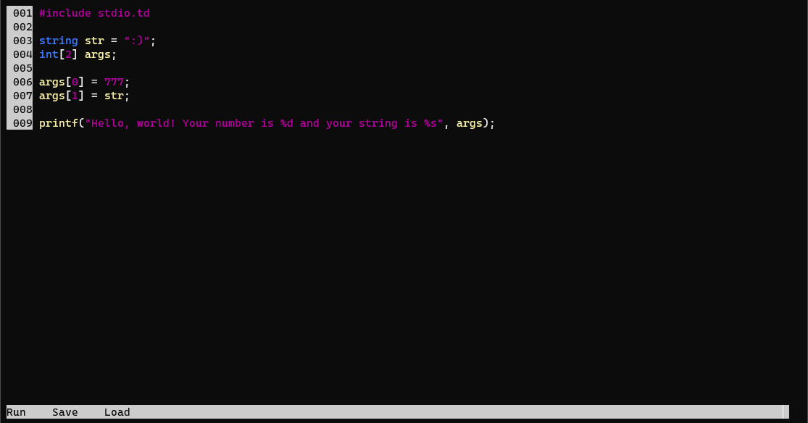
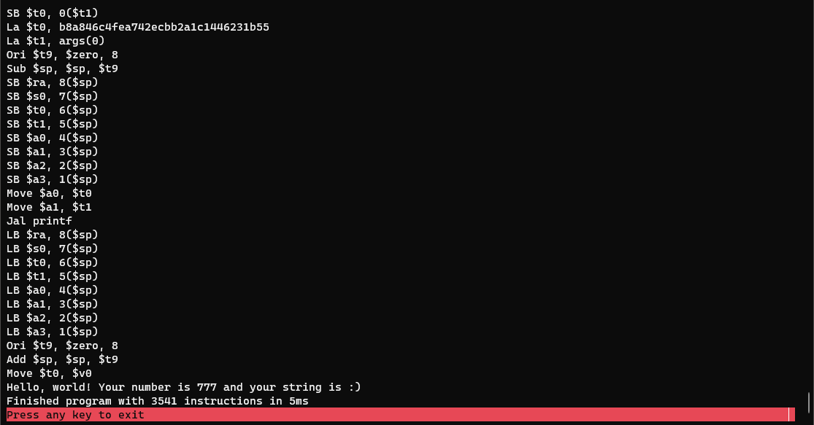
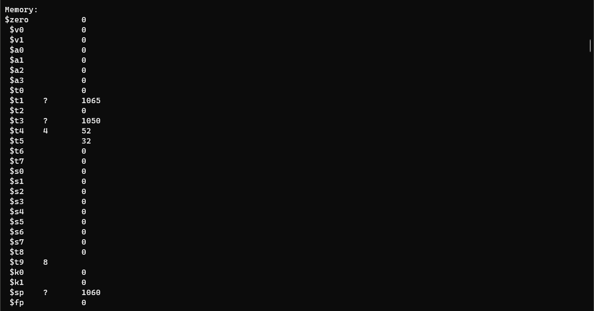

# Overview
### This project is 

- A virtual CPU based on MIPS-1 architecture
- A high level programming language 
- A compiler from the programming language to assembly to machine code

The purpose here was to dive into how CPUs and compilers work. I started from the CPU and built upwards on the stack. This was attempted using the least amount of guidance possible, but [Crafting Interpreters](https://craftinginterpreters.com/) was a huge source of information when stuck.

### Getting Started

The easiest way to get started is to run the sample hello world program with the REPL. 

```
.\TideScriptREPL.exe "Your\Path\To...\Sample\HelloWorld.td"
```

This should load the screen into a fairly basic IDE.


Press F1 and the code will execute



Note that you will get a dump of the compiled assembly, and when you press to continue you will be able to inspect all the memory addresses in the machine.



### Programming Language Features

#### Types & Arrays
```
int x = 1;
string msg = "hello, world!";
int[3] numbers;
```

#### Functions
```
function foo(string bar){
    //Do stuff
}
```

#### Classes
```
class Foo{
     string Name;
     int Count;

     function void Print(){
          print(Name);
          printNum(Count);
     }

     function void AddCount(){
          Count += 1;
     }
}
```

#### Inline Assembly
Use a single pipe to denote inline machine instructions. Note that arguments are stored sequentially from $a0-$a4 and Syscall 4 (print string) will print the string starting at address memory $a0.
```
function print(string Value){
    |Ori $v0, $zero, 4
    |Syscall
}
```

#### Operators
```
"=", "==", "!=", "<", ">", "<=", ">=",
"+", "-", "*", "/", "+=", "-=", "*=", "/=",
"||", "&&"
```

#### Control Statements
```
if (1 > 2){
    //Do stuff
}elseif(2 > 3){
    //Other stuff
}else{
    //Some other stuff
}

while (i < 10){
    //Do stuff
}
```

#### Other Stuff
Return statements for functions, comments.